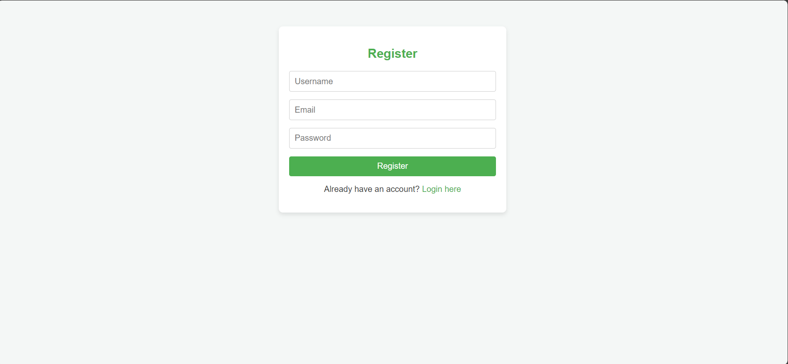
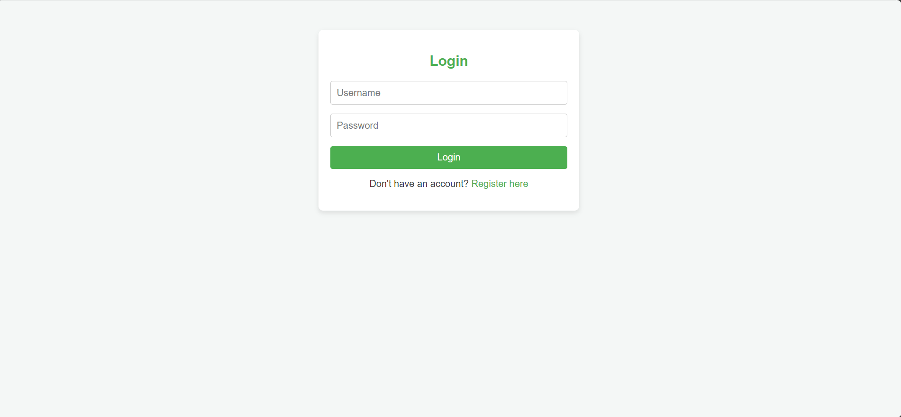
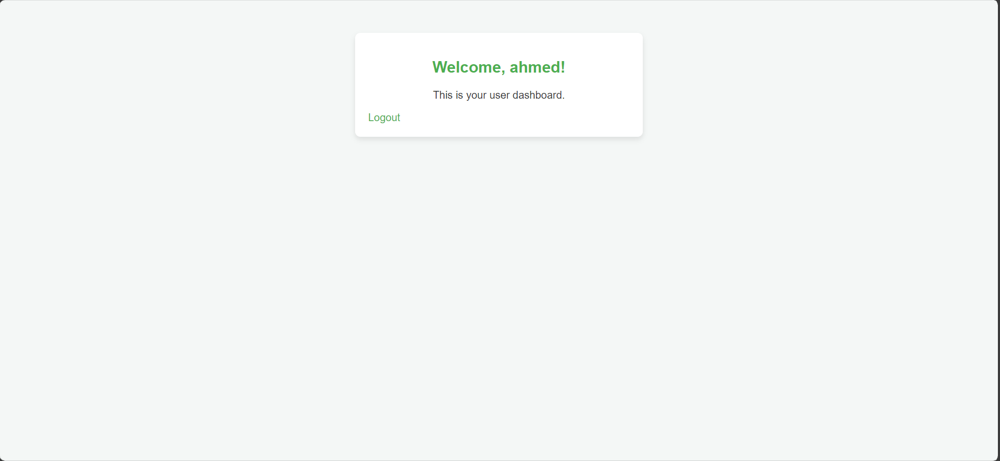

# Ecommerce App Setup Guide

This is a simple guide to set up and run the ecommerce app locally.

## Steps to Set Up

### Clone the repo
- make sure you have [Git](https://git-scm.com/downloads) installed first
- open CMD or powershll then type the following command:
```bash
git clone https://github.com/Helwan-Diploma-SW/user-module-app.git
```
- Then change directory to that location

```bash
cd user-module-app
```

### 1. Create a Virtual Environment
- First, make sure you have [python 3.11.0](https://www.python.org/downloads/release/python-3110/) installed
- then create a virtual environment for the project. This will isolate the project dependencies from your system Python.

```bash
python -m venv venv
```
### 2. Install Dependencies
Once the virtual environment is created, activate it and install the necessary dependencies from requirements.txt.

On Windows:
```bash
.\venv\Scripts\activate
```
On macOS/Linux:
```bash
source venv/bin/activate
```
Then, install the dependencies:

```bash
pip install -r requirements.txt
```
### 3. Run the Application
To start the app, run the following command:

```bash
python app.py
```
### 4. Access the Application
Once the app is running, navigate to http://127.0.0.1:5000/login in your browser to access the login page.

Enjoy using the ecommerce app!

Project Structure

```bash
ecommerce_app/
├── app.py
├── config.py
├── controllers/
│   └── user_controller.py
├── models/
│   └── user.py
├── services/
│   └── user_service.py
├── templates/
│   ├── register.html
│   ├── login.html
│   └── dashboard.html
├── static/
│   ├── css/
│   │   └── styles.css
│   └── js/
│       ├── register.js
│       ├── login.js
└── utils/
    └── db.py
```
## Project images






